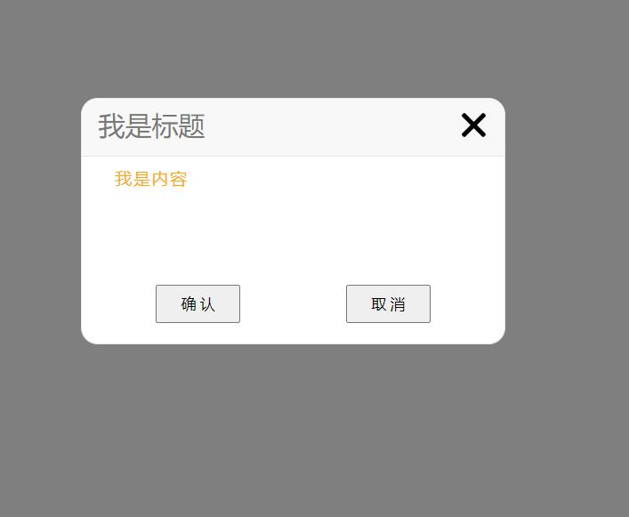

## 弹窗组件说明
> 1. 该组件使用面向对象实现，不需要引入任何JS库
> 2. 参数信息
> 
 参数名        | 参数描述              |是否更改|
 ------------- |------------ 		   |--------|
 id            | 弹窗的父容器		   |否|
 class_name    | 弹窗的各部分的Dom元素 |否 |   
 width 		   | 弹窗的宽度  |允许|
 height		   | 弹窗的高度   |允许|
title_color    | 标题的颜色|允许|
title_fontSize | 标题的字体大小|允许|
title_img      | 你需要更换的图片|允许|
content_color  |  内容的字体颜色|允许|
content_fontSize| 内容的字体大小|允许|
title           |  标题内容|允许|
content         |  内容的内容|允许|
deg             |  悬浮关闭按钮时，旋转的角度|允许|
getDom          |  改方法返回class类名的dom元素|允许|

> 3. 弹窗功能有 点击确认，显示成功，2秒后关闭。点击取消，显示取消，2秒钟关闭。点击右上角的叉叉，立刻退出。鼠标按下拖拽的效果。
 ## 使用方法
>	1. 引入弹窗需要的html、css、js文件。html如下
	```
		//html部分
		 <button id="send">发送</button>
				<div id="shot-container">
					<!-- 遮罩层 -->
					<div class="mask"></div>
					<!-- 弹窗层 -->
					<div class="tanKuang">
						<!-- 标题 -->
						<div class="title">
							<span class="title_name">标题</span>
							
						</div>
						<!-- 内容 -->
						<div class="content">
							这是内容区
						</div>
						<!-- 底部按钮 -->
						<div class="btns">
							<button class="press-true">确 认</button>
							<button class="press-false">取 消</button>
						</div>
					</div>
					<!-- 弹窗显示，确认后的弹出层 -->
					<div class="success">
						<span class="success_text">完 成</span>
						
					</div>
					<!-- 弹窗显示，取消后的弹出层 -->
					<div class="cancel">
						<span class="cancel-text">取 消</span>
					</div>
				</div>
		//css和js引入压缩文件
	```
	
>	2. 当客户点击、触摸等操作时，需要给客户反馈相关信息的按钮绑定事件。
>	示例：
```
	//  script标签需要配置的参数
	var obj = {
		id:"shot-container",
		class_name:["tanKuang","title_name","close","content","press-true","press-false","success","cancel","mask"],
		width:"380px",//弹框的宽
		height:"220px",//弹框的高
		title_color:"skyblue",//标题的颜色
		title_fontSize:"24px",//标题的字体大小
		title_img:"images/close.png",//你需要更换的图片
		content_color:"red",//内容的字体颜色
		content_fontSize:"14px",//内容的字体大小
		title:"我是标题",//标题内容
		content:"我是内容",//内容的内容
		deg:"180",//悬浮关闭按钮时，旋转的角度
		getDom:function(className){
			return document.getElementsByClassName(className)[0];
		}
	}
	var  send = document.getElementById("send");//客户点击按钮
	send.onclick = function(){
		var  tanKuang = new ShotBox(obj);
	}
```
>  3.当你需要定制自己的样式时，弹窗组件说明2的参数信息可供参考 
## 效果图
## 
## 联系方式： 138*********